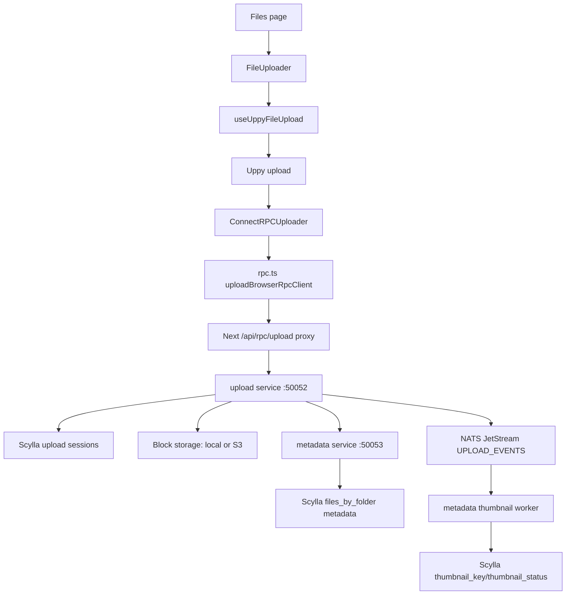

# Upload Flow Introspection

This document maps the current upload path from the Files page to the upload, storage, database, and metadata services. It describes the code as it exists now and calls out the points where the request can stop silently.

## Executive Summary

The intended path is:



A file is not a blob at a storage key — it is an **ordered list of content-addressed block hashes**. Each 4 MB chunk is SHA-256 hashed; blocks shared across files or uploads physically share bytes in storage.

The browser upload RPCs are unary. After the final chunk, the upload service also emits an async `object.stored` event over NATS JetStream; the metadata service's thumbnail worker consumes that event and writes a preview image for image files.

1. `InitUpload` creates an upload session, or returns a dedup hit when a full-file SHA-256 is supplied and already exists.
2. `UploadChunk` sends one chunk at a time; each chunk is written as a content-addressed block.
3. The final chunk triggers finalization: the ordered `block_hash_list` is handed to metadata, a NATS event is published, and the session is marked completed.

The old `UploadChunks` bidi-streaming RPC still exists for native clients, but browser transports cannot send a streaming request body. The browser path must therefore use unary `UploadChunk`.

## Frontend Entry Point

### `web/src/app/(dashboard)/files/page.tsx`

Responsibilities:

- Runs as a client component.
- Reads the authenticated user from `useAuth()`.
- Does not render the uploader until `currentUser` exists.
- Passes `currentUser.userId` to `FileUploader`.

Flow:

```text
FilesPage
  -> useAuth()
  -> currentUser.userId
  -> <FileUploader userId={...} />
```

Failure checkpoints:

- `isLoadingAuth` remains true: page returns `null`.
- `currentUser` is null: page returns `null`.
- Therefore, no file button exists until the auth query completes successfully.

### `web/src/modules/files/components/file-uploader.tsx`

Responsibilities:

- Displays the drag-and-drop area and selected files.
- Provides the file picker and drag/drop handlers.
- Displays Uppy progress and errors.
- Calls `uploadFiles` only when the Upload button is clicked.

Important controls:

```text
Select files / Add files -> openFileDialog()
Drop files             -> addFiles()
Upload files           -> uploadFiles()
Remove file            -> removeFile(file.id)
Remove all             -> clearAll()
```

The current component passes:

```text
maxFiles = 6
maxSizeMB = undefined
accept = undefined
```

With `accept` undefined, the browser picker and Uppy restrictions accept any MIME type, subject to the maximum file count.

The Upload button is disabled only while `isUploading` is true. It must call the hook's `uploadFiles` callback; opening the picker is a separate action.

## Uppy State and Manual Start

### `web/src/modules/files/hooks/use-uppy-file-upload.ts`

Responsibilities:

- Lazily constructs one Uppy instance in the browser.
- Sets `autoProceed: false`, so selecting files does not upload them.
- Installs `GoldenRetriever` for recovery.
- Installs `ConnectRPCUploader` as Uppy's uploader processor.
- Converts selected or dropped `File` objects into Uppy files.
- Exposes `uploadFiles`, which calls `uppy.upload()`.
- Converts Uppy events into UI error state.

Flow:

```text
addFiles(FileList)
  -> uppy.addFile(...)
  -> filesById updates
  -> UI displays selected files

Upload button
  -> uploadFiles()
  -> setIsUploading(true)
  -> uppy.upload()
  -> Uppy invokes registered uploader processor
```

The callback currently exits without a request when either condition is true:

```text
isUploading === true
files.length === 0
```

The first browser-side checkpoint is therefore the selected `files.length` and the value of `isUploading` when the button is clicked.

The hook destroys Uppy on unmount. A reload can restore Uppy state through GoldenRetriever, but the browser `File` data itself may not always be recoverable depending on the recovery state.

## Uppy RPC Adapter

### `web/src/lib/uppy-connectrpc-uploader.ts`

This file is not a second backend client. It is an adapter between Uppy and the generated client exported by `rpc.ts`.

Responsibilities:

1. Receive Uppy file IDs from Uppy.
2. Read the corresponding `Blob` from Uppy state.
3. Call `client.initUpload(...)`.
4. Read the returned `chunkSizeBytes`.
5. Skip chunk indices listed in `alreadyReceivedChunkIndices`.
6. Slice the file into 4 MB chunks.
7. Calculate SHA-256 for each chunk.
8. Call `client.uploadChunk(...)` once per chunk.
9. Emit `upload-progress` after every acknowledgement.
10. Mark the file complete or emit `upload-error`.

Per-file sequence:

```text
Uppy file ID
  -> getFile(fileID)
  -> file.data Blob
  -> InitUploadRequest
  -> InitUploadResponse
  -> for each chunk:
       Blob.slice()
       crypto.subtle.digest("SHA-256", chunk)
       UploadChunkRequest (with chunk_index)
       uploadBrowserRpcClient.uploadChunk(request)
       UploadChunkAck (offsetPersisted, isFinal, deduplicated)
       upload-progress
  -> final ack (isFinal = true)
  -> upload-success
```

Important implementation detail:

- `UploadChunks` is bidi streaming and is not browser-compatible with Connect fetch transports.
- The browser adapter must call generated unary `uploadChunk`, not generated `uploadChunks`.
- The adapter skips chunks whose index appears in `alreadyReceivedChunkIndices` (resume support).
- Each chunk ack includes `deduplicated` to indicate the server skipped a storage write (block already existed).

The adapter currently catches errors, writes the error string to Uppy file state, emits `upload-error`, and rethrows so `uppy.upload()` rejects.

## Browser RPC Clients

### `web/src/lib/rpc.ts`

Responsibilities:

- Defines browser-side generated RPC clients.
- Uses same-origin Next.js proxy paths.
- Does not expose the HttpOnly token to browser JavaScript.

Current clients:

```text
authBrowserRpcClient
  AuthService
  /api/rpc/auth

uploadBrowserRpcClient
  UploadService
  /api/rpc/upload
```

The upload client uses `createConnectTransport` because `InitUpload` and unary `UploadChunk` are browser-compatible unary RPCs.

The client does not call `localhost:50052` directly from the browser. It calls the Next.js same-origin route.

### `web/src/lib/rpc-server.ts`

Responsibilities:

- Server-only RPC clients.
- Reads the access token from the HttpOnly cookie through `getServerAccessToken()`.
- Adds `Authorization: Bearer <token>` using a Connect interceptor.
- Defines server-side clients for auth and upload services.

This file is used by Server Actions and server-side code. It is not imported by the client uploader.

## Next.js RPC Proxy

### `web/src/app/api/rpc/upload/[[...path]]/route.ts`

Responsibilities:

- Receives browser RPC requests at `/api/rpc/upload/...`.
- Calls `createRpcProxy(...)` with the upload backend URL.
- Exports GET and POST handlers.

### `web/src/lib/create-rpc-proxy.ts`

Responsibilities:

1. Read `access_token` or the production `__Host-access_token` cookie.
2. Strip `/api/rpc/upload` from the URL.
3. Forward the request to `UPLOAD_RPC_URL` or `http://localhost:50052`.
4. Remove browser `Host` and `Cookie` headers.
5. Attach `Authorization: Bearer <access token>`.
6. Preserve the Connect request body and response body.

Expected request mapping:

```text
POST /api/rpc/upload/upload.UploadService/InitUpload
  -> POST http://localhost:50052/upload.UploadService/InitUpload

POST /api/rpc/upload/upload.UploadService/UploadChunk
  -> POST http://localhost:50052/upload.UploadService/UploadChunk
```

The proxy is the only browser-to-backend boundary for the upload RPCs.

## Authentication and Request Context

### `web/src/proxy.ts`

Responsibilities:

- Runs as Next middleware/proxy for protected routes.
- Validates the refresh token.
- Refreshes the access/refresh pair when the access token is missing or near expiry.
- Writes refreshed cookies in the `NextResponse`.
- Matches application pages and RPC routes while excluding public/static paths.

Potential timing issue:

- A request already in flight cannot be repaired by a cookie refresh that occurs in a different request.
- The RPC proxy reads the access cookie present on its own request.
- If that cookie is invalid rather than merely expired, the backend rejects it and the browser request must be retried after refresh.

### `web/src/lib/auth-cookie.ts`

Defines the cookie names:

```text
Development:
  access_token
  refresh_token

Production:
  __Host-access_token
  __Host-refresh_token
```

The names must match between login actions, refresh proxy, server RPC clients, and `createRpcProxy`.

### `pkg/interceptor/auth.go`

The shared Go auth interceptor:

1. Reads `Authorization`.
2. Requires the `Bearer ` prefix.
3. Verifies the access token with JWKS.
4. Requires `token_type = access`.
5. Requires session ID and generation claims.
6. Injects the authenticated user ID into context under `user_id`.

Every upload and metadata handler expects that context value.

## Upload Backend

### `proto/upload/upload.proto`

Defines the upload contract:

```text
InitUpload(InitUploadRequest) -> InitUploadResponse
UploadChunk(UploadChunkRequest) -> UploadChunkAck
UploadChunks(stream UploadChunkRequest) -> stream UploadChunkAck
GetUploadStatus(GetUploadStatusRequest) -> GetUploadStatusResponse
```

`UploadChunk` was added for browser compatibility. `UploadChunks` remains the streaming/native-client API.

`InitUploadRequest` carries an optional `sha256_of_full_file`. When present, the service short-circuits on a dedup hit. `InitUploadResponse` returns:

```text
upload_id
chunk_size_bytes              server-configured block size (4 MB)
already_received_offsets      empty for a fresh upload
already_received_chunk_indices  bitmap of received chunks for resume
already_complete              true on a dedup hit
object_id                     existing storage key on a dedup hit
```

The browser adapter currently sends only `filename`, `total_size_bytes`, and `content_type`, so browser uploads do not trigger pre-upload dedup.

### `services/upload/gen/pb/upload.pb.go`

Generated Go protobuf message types for upload requests and responses.

### `services/upload/gen/pb/pbconnect/upload.connect.go`

Generated Go Connect client and server interfaces. It registers the unary and streaming procedure paths and connects the generated handler to the HTTP mux.

### `web/src/gen/pb/upload/upload_pb.ts`

Generated TypeScript descriptors and types. The generated `UploadService` descriptor must contain both:

```text
initUpload
uploadChunk
uploadChunks
getUploadStatus
```

If `uploadChunk` is missing, `make proto-upload` or `make proto` has not been run after changing the proto.

### `services/upload/server/grpc.go`

The transport-level upload handler.

`InitUpload`:

- Reads `user_id` from context.
- Validates filename and positive total size.
- Logs upload initialization.
- Calls `UploadService.InitUpload`.
- Returns upload ID, chunk size, resume offsets, and dedup result.

`UploadChunk`:

- Reads `user_id` from context.
- Validates upload ID, offset, and non-empty data.
- Logs receipt.
- Calls `UploadService.ReceiveChunk`.
- Logs persistence/final status.
- Returns offset, final acknowledgement, and dedup flag.

`UploadChunks`:

- Handles the existing bidi streaming path.
- Reads the first request to identify the upload ID.
- Processes subsequent chunks until final or EOF.

### `services/upload/internal/service/upload_service.go`

The upload domain/service layer.

`InitUpload`:

- Validates filename and size.
- Creates a session in Scylla (`pending`) with `ChunkBlockMap = {}`, `UploadedBitmap = []`.
- Writes Redis key `upload:<id>:last_offset = 0` for fast status lookups.
- Returns the configured block size (4 MB default).

`ReceiveChunk`:

1. Loads and validates the session; rejects unless status is `pending` or `in_progress`.
2. Verifies the chunk SHA-256 against the declared `sha256_of_chunk`.
3. Validates the chunk size: every chunk except the final one must equal the session block size; the final chunk completes `total_size`.
4. **Block-level dedup** (when `blockRepo` and `blockGateway` are configured):
   - Looks up the block hash in Scylla `blocks` table.
   - If found: increments ref count, skips storage write (deduplicated = true).
   - If not found: writes block via `blockGateway.WriteBlock`, inserts block record via `blockRepo.InsertBlock`.
   - Records the block hash for this chunk index via `sessionRepo.RecordBlockForChunk`.
5. **Legacy path** (when block repos are nil): falls back to the legacy `StorageGateway.WriteChunk`.
6. Moves session status `pending` -> `in_progress`.
7. Refreshes session; checks if `ChunkBlockMap` has all expected chunk indices (`ceil(totalSize / blockSize)`).
8. When all chunks received, calls `finalizeUpload`.

`finalizeUpload`:

1. Reloads session; builds ordered `block_hash_list` from `ChunkBlockMap` keys in index order.
2. Calls `createMetadataRecord` with the block hash list (see Metadata Backend below).
3. Calls `publishObjectStoredEvent` with schema v2 payload including `block_hash_list`.
4. Marks session `completed` in Scylla.
5. A NATS publish failure only logs a warning; the upload still succeeds.

`createMetadataRecord`:

- Extracts the validated bearer token from request context via `interceptor.AccessTokenFromContext(ctx)`.
- Creates a Connect client against `cfg.MetadataURL` (default `http://localhost:50053`).
- Sends `CreateFile` with `block_hash_list` (not `storage_key`).
- Forwards the original user's bearer token as `Authorization: Bearer <token>`.
- Without a valid token in context, finalization fails.

## Upload Service Wiring

### `services/upload/cmd/main.go`

Startup sequence:

1. Load upload configuration.
2. Initialize the JWKS verifier and the shared auth interceptor.
3. Connect to Scylla.
4. Run upload migrations.
5. Create Ristretto cache.
6. Connect to Redis.
7. Create `SessionRepo` and `BlockRepo`.
8. Create `BlockGateway` (local or S3 depending on config).
9. Create legacy `StorageGateway` (local filesystem) for backward compatibility.
10. Create the NATS event publisher via `NATS_URL` + `NATS_EVENT_SUBJECT`. If NATS is unreachable, it logs a warning and sets the publisher to `nil`, which the service replaces with `NoopEventPublisher`; the upload path still works, only async events are lost.
11. Create `UploadService` with all dependencies wired.
12. Create `UploadServer`.
13. Register the generated UploadService handler with the logging and auth interceptors on an h2c HTTP server.
14. Listen on `UPLOAD_GRPC_PORT`, default `50052`.

This file is also the first backend checkpoint when the service is silent: it must log `upload service starting` and listen on the expected port.

### `services/upload/config/config.go`

Relevant defaults:

```text
UPLOAD_GRPC_PORT      50052
METADATA_URL          http://localhost:50053
REDIS_URL             redis://localhost:6379
NATS_URL              nats://localhost:4222
NATS_EVENT_SUBJECT    uploads.object.stored
CHUNK_SIZE_BYTES      4194304          (4 MiB content-addressed blocks)
BLOCK_SIZE_BYTES      4194304          (4 MiB, overrides CHUNK_SIZE_BYTES when set)
S3_BUCKET             uploads
S3_REGION             us-east-1
S3_ENDPOINT           (empty, uses AWS)
S3_STORAGE_BACKEND    s3
UPLOAD_STORAGE_PATH   ./uploads
SESSION_TTL_SECONDS   86400
```

When `BlockSizeBytes > 0`, it overrides `ChunkSizeBytes` so both fields refer to the same 4 MB block. A 4 MB block means a 5 MB test file produces two chunks.

### `services/upload/internal/repository/session_repo.go`

Persists and loads upload sessions in Scylla.

`UploadSession` struct fields:

```text
UploadID        string
UserID          string
Filename        string
TotalSize       int64
BlockSizeBytes  int64
ChunkBlockMap   map[int]string     chunk_index -> block_hash
UploadedBitmap  []byte             bitmap of received chunk indices
ContentType     string
ContentHash     string
Status          string             pending | in_progress | completed | aborted
CreatedAt       time.Time
ExpiresAt       time.Time
```

Key methods:

- `CreateSession`: inserts new session with empty `ChunkBlockMap` and `UploadedBitmap`.
- `GetSession`: loads full session including block map and bitmap.
- `RecordBlockForChunk`: updates `ChunkBlockMap[chunkIndex] = blockHash`, sets bitmap bit, and persists both to Scylla. This is the Scylla source-of-truth write for each chunk.
- `ReceivedChunkIndices`: decodes the bitmap and returns sorted received chunk indices.
- `UpdateSessionStatus`: sets session status.

### `services/upload/internal/repository/block_repo.go`

Manages the content-addressed `blocks` table in Scylla.

`Block` struct:

```text
Hash           string      block SHA-256 hex
SizeBytes      int64
RefCount       int64       number of files referencing this block
StorageBackend string      "s3" | "local"
StorageKey     string      blocks/<h[0:2]>/<h[2:4]>/<h>
ETag           string      storage integrity checksum
CreatedAt      time.Time
```

Key methods:

- `GetBlock`: looks up a block by hash; returns `IsBlockNotFound` error if absent.
- `InsertBlock`: inserts with `ref_count = 1` using `IF NOT EXISTS` for idempotency. Storage key is derived as `blocks/<h[0:2]>/<h[2:4]>/<h>`.
- `IncrementRefCount`: reads current ref count, writes `ref_count + 1`.
- `DecrementRefCount`: reads current ref count, writes `ref_count - 1`, returns new count.

### `services/upload/internal/storagegateway/block_gateway.go`

The content-addressed block storage interface:

```text
WriteBlock(ctx, hash, data) -> (etag, error)
ReadBlock(ctx, hash) -> ([]byte, error)
BlockExists(ctx, hash) -> (bool, error)
DeleteBlock(ctx, hash) -> error
```

Two implementations exist:

- `LocalBlockGateway`: stores blocks under `UPLOAD_STORAGE_PATH/blocks/<h[0:2]>/<h[2:4]>/<h>`.
- `S3BlockGateway`: stores blocks in S3/RustFS under the same key structure.

### `services/upload/internal/storagegateway/gateway.go`

Legacy `StorageGateway` interface. **Compatibility only** — not used on the primary write path when block storage is configured. It still defines:

```text
WriteChunk(ctx, uploadID, offset, data, expectedSha256) -> error
ReadChunk(ctx, uploadID, offset) -> ([]byte, error)
FinalizeUpload(ctx, uploadID, totalSize) -> (storageKey, error)
HashFinalizedObject(ctx, uploadID) -> (sha256hex, error)
AbortUpload(ctx, uploadID) -> error
```

`LocalFileSystemGateway` is the old `final.bin` implementation (chunks under `<basePath>/<uploadID>/<offset>.chunk`, concatenated into `final.bin`). This path is completely retired on the block path — `InitUpload` writes sessions, `ReceiveChunk` writes content-addressed blocks via `BlockGateway`, and `finalizeUpload` never touches `final.bin`.

The primary storage path in `ReceiveChunk` is:

```text
blockRepo.GetBlock(hash)                                         dedup lookup in Scylla
  -> exists: blockGateway.BlockExists? IncrementRefCount          skip write (deduplicated)
  -> absent: blockGateway.WriteBlock + blockRepo.InsertBlock      write new block
  -> then: sessionRepo.RecordBlockForChunk(chunkIndex, hash)      durable chunk->block mapping
```

`finalizeUpload` builds the ordered `block_hash_list` directly from the session's `ChunkBlockMap` — there is no `final.bin`, no storage gateway `FinalizeUpload`, and no `HashFinalizedObject` call on the block path.

### `services/upload/internal/repository/bitmap.go`

Utility for encoding/decoding chunk-received bitmaps:

- `SetBitmapBit(bitmap, index)`: sets bit at position `index` in a growable byte slice.
- `HasBitmapBit(bitmap, index)`: reads bit at position `index`.

Bitmaps are stored on the `upload_sessions` table and used to determine resume state.

### `services/upload/db/migrations/`

Schema migrations:

- `1_upload_sessions.cql`: base session table.
- `2_upload_chunks.cql`: chunk tracking table.
- `4_add_block_upload_state.cql`: adds `chunk_block_map`, `uploaded_bitmap`, `block_size_bytes` to sessions.
- `6_drop_legacy_upload_schema.cql`: cleans up retired schema.

The `blocks` table migration (content-addressed block storage) is part of this set.

## Metadata Backend

### `services/upload/internal/service/upload_service.go:createMetadataRecord`

Metadata is not called when a file is selected. It is not called at `InitUpload`. It is called only during finalization after all chunks are received and block hashes are assembled.

The upload service builds a connect client against `METADATA_URL`, then sends `CreateFile` with:

```text
folder_id      = session.UserID   (the user's root folder, which equates to the user ID)
filename       = session.Filename
size_bytes     = session.TotalSize
content_type   = session.ContentType
content_hash   = session.ContentHash
block_hash_list = ordered block hashes from ChunkBlockMap
```

The call forwards the authenticated user's token. `createMetadataRecord` reads the validated bearer token out of the request context via `interceptor.AccessTokenFromContext(ctx)` and sets `Authorization: Bearer <token>` on the outgoing request. Without a token in context, it fails the finalization.

The metadata `CreateFile` response returns the new `file_id`, which the upload service then includes in the NATS event.

### `proto/metadata/metadata.proto`

Defines the metadata contract:

```text
CreateFile(CreateFileRequest) -> CreateFileResponse
SetThumbnail(SetThumbnailRequest) -> SetThumbnailResponse
GetThumbnailStatus(GetThumbnailStatusRequest) -> GetThumbnailStatusResponse
GetFile(GetFileRequest) -> File
ListFolder(ListFolderRequest) -> ListFolderResponse
DeleteFile(DeleteFileRequest) -> DeleteFileResponse
```

The `CreateFileRequest` carries `block_hash_list` (not `storage_key`). The `File` message carries `block_hash_list`, `thumbnail_key`, and `thumbnail_status`.

### `services/metadata/internal/repository/metadata_repo.go`

Metadata is persisted in Scylla's `files_by_folder` table. `CreateFile` inserts a new row with `file_id` (UUID), `version = 1`, `owner_id`, `block_hash_list`, `thumbnail_key = ""`, and `thumbnail_status = "pending"`.

`SetThumbnail` and `GetThumbnailStatus` read/write `thumbnail_key` + `thumbnail_status` on that row. `GetFile` and `ListFolder` return `block_hash_list` so the file content can be reconstructed from blocks.

### `services/metadata/server/grpc.go`

`CreateFile`:

- Expects `user_id` in context (set by the auth interceptor).
- Validates filename.
- Calls the metadata service.
- Writes the metadata record with `block_hash_list`.
- Returns the file ID and metadata.

`SetThumbnail` / `GetThumbnailStatus`: both require `user_id` in context, validate `file_id`, and delegate to the service. The thumbnail worker is the primary caller of `SetThumbnail`; the UI can poll `GetThumbnailStatus` to learn when a preview is ready.

### `services/metadata/cmd/main.go`

Startup sequence:

1. Load metadata config.
2. Initialize the JWKS verifier and the shared auth interceptor.
3. Connect to Scylla.
4. Run metadata migrations.
5. Create Ristretto cache.
6. Create metadata and folder repositories.
7. Create the thumbnail worker (see below) and `Start` it. NATS/worker failures only log warnings; the metadata RPC server still runs without thumbnail generation.
8. Create metadata service and Connect server.
9. Register MetadataService on h2c with the logging and auth interceptors, behind CORS.
10. Listen on `METADATA_GRPC_PORT`, default `50053`.

### `services/metadata/config/config.go`

Relevant defaults:

```text
METADATA_GRPC_PORT      50053
NATS_URL                nats://localhost:4222
NATS_EVENT_SUBJECT      uploads.object.stored
THUMBNAIL_STORAGE_PATH  ../upload/uploads
S3_BUCKET               uploads
S3_REGION               us-east-1
JWKS_URL                http://localhost:50051/.well-known/jwks.json
```

`THUMBNAIL_STORAGE_PATH` is the local fallback block directory when no S3 endpoint is configured; it must point at the same directory tree as the upload service's `UPLOAD_STORAGE_PATH` so the worker can read block files. When `S3_ENDPOINT` is set, the worker reads blocks from S3 and `THUMBNAIL_STORAGE_PATH` is unused for block reads.

## NATS Event Bus and Thumbnail Generation

### Publisher (`services/upload/internal/service/upload_service.go`)

`NATSEventPublisher` connects to NATS and, if the `UPLOAD_EVENTS` JetStream stream does not exist, creates it with:

```text
Retention  LimitsPolicy
Storage    FileStorage
MaxAge     7 days
Subjects   [NATS_EVENT_SUBJECT]
```

After finalization, `publishObjectStoredEvent` marshals `ObjectStoredEvent` to JSON and publishes it to `uploads.object.stored` with `nats.MsgId(FileID)` so NATS dedups duplicate publishes for the same file. Event payload (schema v2):

```text
schema_version  = "v2"
file_id
block_hash_list = ordered content-addressed block hashes
content_type
size_bytes
owner_id
stored_at_unix
```

A publish failure never fails the upload ack; the warning "object stored event publish failed; reconciliation will repair" is logged instead.

### Consumer (`services/metadata/internal/thumbnail/worker.go`)

The metadata service runs a `thumbnail.Worker` that subscribes to the same subject on the `UPLOAD_EVENTS` stream with a durable name `metadata-thumbnail-worker` and `ManualAck`.

Per event, the worker:

1. Unmarshals the JSON; malformed events are acked and dropped.
2. **Schema gate**: requires `schema_version = "v2"` and non-empty `block_hash_list`; legacy v1 events (carrying only `storage_key`) are acked and skipped, no thumbnail generated.
3. For `file_id` + `owner_id` present, calls `generate`:
   - Rejects non-image content types (`image/svg+xml` is also excluded); the event lands with `thumbnail_status = failed`.
   - Computes a deterministic thumbnail key by hashing the `block_hash_list` (`thumbnails/<sha256-of-hashes>.jpg`); if that thumbnail already exists (S3 HeadObject or local stat), returns it without regenerating.
   - Reads blocks in order via `readBlock` (S3 `GetObject` when S3 is configured; else local `storagePath/blocks/<h[0:2]>/<h[2:4]>/<h>`), concatenating into a decode buffer.
   - Decodes the image, scales it down to fit within 512x512 (nearest-neighbor `fit`), and writes the thumbnail as a JPEG (quality 85) — to S3 when S3 is configured, else local under `storagePath/thumbnails/`.
4. Updates Scylla via `repo.SetThumbnail(owner_id, file_id, thumbnailKey, status)`:
   - `ready` + thumbnail key on success.
   - `failed` + empty key on generation error.
5. Acks the message.

The worker is started from `services/metadata/cmd/main.go` and closes its subscription on shutdown. Generation currently uses Go's stdlib `image`/`jpeg` decoders, covering JPEG/PNG/GIF/etc.; formats stdlib cannot decode produce `failed` status.

## Current Silent-Failure Checkpoints

Use this order when the upload and metadata logs are silent:

1. **Files page rendered?**
   - Confirm `currentUser` exists and `FileUploader` is mounted.
2. **Selected files present?**
   - Confirm the UI shows `Files (N)`.
3. **Button handler invoked?**
   - Confirm `uploadFiles()` runs and `uppy.upload()` is called.
4. **Uppy uploader installed?**
   - Confirm `ConnectRPCUploader.install()` ran and `addUploader()` registered the processor.
5. **Browser request created?**
   - Network tab should show `POST /api/rpc/upload/.../InitUpload`.
6. **Next proxy reached?**
   - Confirm the request path is under `/api/rpc/upload` and the route exists.
7. **Bearer attached?**
   - Confirm the proxy reads the current access-token cookie.
8. **Upload handler reached?**
   - Upload service should log `upload initialization requested`.
9. **Auth context populated?**
   - The upload handler requires `user_id`; missing context yields unauthenticated.
10. **Chunk handler reached?**
    - Upload service should log `upload chunk received` for unary chunks.
11. **Block dedup check succeeded?**
    - Look for block existence check and either ref count increment (dedup) or block write.
12. **Session block map updated?**
    - `RecordBlockForChunk` must persist the chunk-to-block mapping in Scylla.
13. **All chunks received?**
    - `ChunkBlockMap` must have `ceil(totalSize / blockSize)` entries.
14. **Metadata callback reached?**
    - Metadata service should log the `CreateFile` request with `block_hash_list`.
15. **Metadata auth context populated?**
    - Metadata also requires `user_id` in context; the upload service forwards the bearer token, so the original token must still be valid.
16. **NATS event published?**
    - Look for the publish warning in upload logs, or the JetStream `UPLOAD_EVENTS` stream on the `uploads.object.stored` subject.
17. **Thumbnail worker consumed the event?**
    - Metadata service should log `thumbnail worker started` at boot; generation failures log `thumbnail generation failed`.
18. **Thumbnail metadata updated?**
    - `files_by_folder.thumbnail_status` should flip from `pending` to `ready` (with `thumbnail_key`) or `failed`.

## Implemented Authentication Wiring

The previously identified authentication gaps are now addressed:

- `pkg/interceptor/auth.go` implements a concrete `connect.Interceptor` with:
  - `WrapUnary` for `InitUpload`, unary `UploadChunk`, metadata calls, and other unary RPCs.
  - `WrapStreamingClient` as an explicit pass-through.
  - `WrapStreamingHandler` for native bidi `UploadChunks` calls.
- Streaming authentication reads `Authorization` from `conn.RequestHeader()` before the handler can receive the first message.
- The interceptor validates the bearer token through JWKS, checks that it is an access token with session claims, and injects both typed context values:
  - `interceptor.ContextKeyUserID`
  - `interceptor.ContextKeyAccessToken`
- Upload and metadata handlers use `interceptor.UserIDFromContext(ctx)`, so the typed context key cannot be confused with a raw string key.
- `services/upload/cmd/main.go` and `services/metadata/cmd/main.go` initialize JWKS using `JWKS_URL`, `JWKS_ISSUER`, and `JWKS_AUDIENCE`, then attach the auth interceptor to their generated Connect handlers.
- `services/upload/internal/service/upload_service.go` forwards the validated access token as `Authorization: Bearer ...` when it calls metadata `CreateFile` during finalization.

The browser path remains unary-only:

```text
browser InitUpload
  -> /api/rpc/upload proxy
  -> upload handler + auth interceptor

browser UploadChunk x N
  -> /api/rpc/upload proxy
  -> upload handler + auth interceptor
  -> block dedup check
  -> block storage write (or skip if deduplicated)
  -> session block map update

final UploadChunk
  -> all chunks received (bitmap complete)
  -> finalize: build block_hash_list
  -> metadata CreateFile with block_hash_list + forwarded bearer token
  -> NATS object-stored event (schema v2)
```

The streaming `UploadChunks` RPC is now authenticated for native clients even though browser clients use unary `UploadChunk`.

## Verified Wiring and Remaining Risks

### Auth interceptor registration (verified)

Both `services/upload/cmd/main.go` and `services/metadata/cmd/main.go` initialize the shared `pkg/interceptor.NewAuthInterceptor` with the JWKS verifier and attach it to their Connect handlers via `connect.WithInterceptors` on the generated handler constructor. Both handlers read `user_id` through `interceptor.UserIDFromContext`, so unauthenticated requests are rejected before reaching the service layer.

### Upload-to-metadata authentication (resolved)

The upload service no longer calls metadata anonymously. `createMetadataRecord` reads the validated bearer token from the request context (`interceptor.AccessTokenFromContext`) and sets `Authorization: Bearer <token>` on the metadata `CreateFile` call. Metadata's auth interceptor then validates it exactly like any other caller.

Residual risk: the token forwarded to metadata must still be valid at finalization time. If the token expired after `InitUpload` but before the last chunk, the metadata call fails and the upload ack fails. Retry after refresh is required.

### NATS dependency

The thumbnail pipeline is fully optional in the failure sense but not in the feature sense:

- If NATS is down at upload startup, the publisher is disabled (`NoopEventPublisher`) and no thumbnail is generated, but uploads still succeed.
- If NATS is up at upload publish time but the publish fails, the upload succeeds with a warning only; no retry/reconcile producer exists yet.
- The `UPLOAD_EVENTS` stream is created lazily by `NATSEventPublisher` (upload service startup) only when it is missing. The metadata thumbnail worker only subscribes; if the stream does not exist, its subscribe fails and thumbnail generation is disabled with a warning.

### Block-level dedup correctness

`IncrementRefCount` in `BlockRepo` is not atomic — it reads the current count then writes `count + 1`. Under concurrent uploads sharing the same block, a lost update could leave ref count lower than actual references. The existing reconciliation pattern ("NATS publish failure; reconciliation will repair") is the accepted mitigation; a production system should consider Scylla LWW counters or an application-level lock.

### Storage bus / thumbnail worker

The thumbnail worker reads blocks via the storage gateway abstraction (S3 or local block store), not `final.bin`. It is driven by the schema-v2 event's `block_hash_list`:

- Requires `SchemaVersion = "v2"` and non-empty `BlockHashList`; legacy v1 events (which carried only `storage_key`) are skipped by the worker.
- Reads blocks in order via `readBlock` (S3 `GetObject` when S3 configured, else local `blocks/<h[0:2]>/<h[2:4]>/<h>`), concatenating into a decode buffer.
- Writes the thumbnail to a deterministic key derived from hashing the `block_hash_list` (`thumbnails/<sha256-of-hashes>.jpg`), in S3 when configured or local under the storage path.
- Therefore the upload service and metadata service must share the same S3 bucket (or local block directory) so the worker can read blocks the upload service wrote.

### Next proxy matcher and cookies

The browser upload request depends on:

```text
proxy.ts matcher
  -> access-token cookie exists and is fresh
  -> createRpcProxy reads the same cookie
  -> Authorization header is attached
```

A stale, invalid, missing, or mismatched cookie name causes the upload handler to reject the call before upload initialization.

## Runtime Ports and Commands

```text
Auth       localhost:50051
Upload     localhost:50052
Metadata   localhost:50053
Redis      localhost:6379
Scylla     localhost:9042
RustFS     localhost:9000, localhost:9001
NATS       localhost:4222
```

Start dependencies:

```powershell
podman compose up -d
```

Start services from the repository root:

```powershell
make run-auth
make run-upload
make run-metadata
```

Regenerate upload bindings after changing `proto/upload/upload.proto`:

```powershell
make proto-upload
```

Run focused upload tests:

```powershell
Set-Location services/upload
go test ./...
```

Run the web typecheck from the web directory:

```powershell
Set-Location web
bun x tsc --project tsconfig.json --noEmit
```

The current full web typecheck has an unrelated existing error in `web/src/modules/dashboard/components/dashboard-sidebar.tsx` concerning the `match` field type. That error is separate from the upload path.
