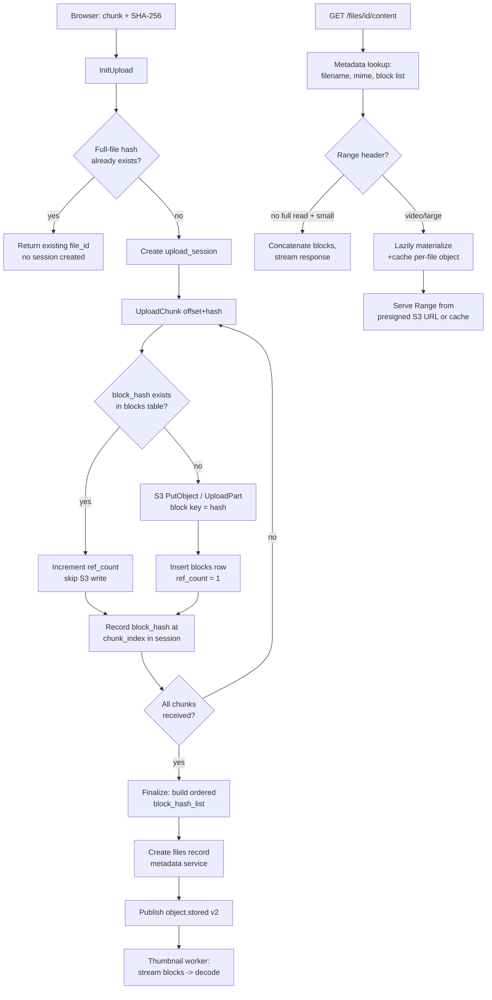

# Migration Map: Local-Disk Chunked Upload → Content-Addressed Block Storage on S3

This document maps every component that needs to be **added**, **edited**, or **retired** to take the
current upload service (as described in `UPLOAD_FLOW.md`, `local_filesystem.go`, `upload_service.go`,
`session_repo.go`) to a Dropbox/Magic-Pocket-style system: content-addressed 4MB blocks, S3-backed
storage, presigned reads, and ref-counted dedup.

It is organized as: target architecture → schema diffs → per-file change list → serving layer (new) →
migration phasing → risks.

---

## 1. Target Architecture



Key structural shift: **a file is no longer a blob at a storage key — it is an ordered list of block
hashes.** Two files (or two versions of the same file) that share blocks physically share bytes in S3,
across all users.

---

## 2. Schema Changes (ScyllaDB)

### 2.1 New table: `blocks`

```sql
CREATE TABLE blocks (
    block_hash       text PRIMARY KEY,   -- sha256 hex, 4MB block content
    size_bytes       int,
    ref_count        counter,            -- or bigint with LWW if you need read-modify-write elsewhere
    storage_backend  text,               -- "s3" | "local" (for dual-write during migration)
    s3_key           text,               -- blocks/<hash[0:2]>/<hash[2:4]>/<hash>
    etag             text,               -- S3 ETag, used as integrity check instead of re-hashing on read
    created_at       timestamp
);
```

> Note: Scylla `counter` columns can't coexist with non-counter columns in the same table in some
> versions/configs. If that's a constraint here, split `ref_count` into a separate counter table
> `block_ref_counts(block_hash PRIMARY KEY, ref_count counter)` and join in the repo layer.

### 2.2 Modify `upload_sessions`

Add:

```sql
ALTER TABLE upload_sessions ADD chunk_block_map map<int, text>;   -- chunk_index -> block_hash
ALTER TABLE upload_sessions ADD uploaded_bitmap  blob;             -- or set<int> of received chunk indices
ALTER TABLE upload_sessions ADD block_size_bytes int;              -- now 4MB, was CHUNK_SIZE_BYTES=32MB
```

`ChunkSize` in the existing `UploadSession` struct becomes `BlockSize` semantically — rename for
clarity or keep the field and just change the configured value.

### 2.3 New table: `files` (may already partially exist as `files_by_folder` in the metadata service —

reconcile rather than duplicate)

```sql
CREATE TABLE files (
    file_id           uuid PRIMARY KEY,
    owner_id          text,
    filename          text,
    extension         text,
    mime_type         text,
    total_size        bigint,
    block_hash_list   list<text>,   -- ordered, replaces storage_key
    content_hash      text,          -- full-file sha256, kept for whole-file dedup
    status            text,
    created_at        timestamp
);
```

This is the biggest cross-service change: **`storage_key` as a single string is retired** as the
thing that resolves file bytes. It's replaced by `block_hash_list`. Metadata's `CreateFileRequest`
proto and `metadata_repo.go` both need this field added (see §4.4).

### 2.4 `objects_by_hash` (existing, keep)

Keep as-is for **whole-file** dedup (the fast path where `InitUpload` short-circuits on
`sha256_of_full_file` before any chunks are sent). This is a different, cheaper dedup layer than
block-level dedup and both are worth keeping — whole-file hit avoids the client ever hashing/sending
chunks; block-level hit avoids storage writes when only part of a file is shared or the client didn't
send a pre-hash.

### 2.5 Redis keys

```text
upload:<upload_id>:bitmap        -- bitset of received chunk indices, TTL = session TTL
upload:<upload_id>:chunk_blocks  -- hash of chunk_index -> block_hash, TTL = session TTL
block:<hash>:exists              -- optional read-through cache to avoid a Scylla round trip
                                     per chunk on hot/duplicate blocks (short TTL, e.g. 10 min)
```

`last_offset` (single int) is retired — replaced by the bitmap, because with dedup a chunk can be
"received" out of order relative to storage writes (a duplicate block resolves instantly). Resume
logic becomes "which chunk indices are missing from the bitmap," not "what's the highest contiguous
offset."

---

## 3. Proto Changes

### `proto/upload/upload.proto`

- `UploadChunkRequest`: keep `offset`/`chunk_index` (rename `offset` → `chunk_index` if the client
  moves to fixed 4MB blocks; if you keep variable offsets you still need per-chunk hash, so no
  functional loss).
- `InitUploadResponse.already_received_offsets` → `already_received_chunk_indices` (bitmap decoded
  server-side, list of missing/received indices).
- `UploadChunkAck`: add `deduplicated: bool` so the client/UI can optionally show "skipped, already
  stored" (nice-to-have, not required).
- New RPC (or reuse `GetUploadStatus`): return the bitmap directly instead of a single offset.

### `proto/metadata/metadata.proto`

- `CreateFileRequest`: replace `storage_key: string` with `block_hash_list: repeated string` (or keep
  both during transition — see §7 migration phasing).
- `File` message: same change, plus keep `content_type`, `thumbnail_key`, `thumbnail_status` as-is.
- New RPC: `GetFileContent`-adjacent info isn't needed in metadata itself if the new **content-serving
  endpoint** (§5) lives in the upload/storage service and calls metadata's existing `GetFile` to
  resolve `block_hash_list` + `mime_type` + `filename`.

Regenerate bindings (`make proto-upload`, `make proto-metadata`, plus the TS descriptors under
`web/src/gen/pb`) after these changes, same as today's `make proto-upload` step.

---

## 4. Per-File Change List

### 4.1 `services/upload/internal/storagegateway/` — **replace, don't patch**

Add a new implementation alongside (not instead of, until cutover) `local_filesystem.go`:

**New file: `s3_block_gateway.go`**

```go
type S3BlockGateway struct {
    client *s3.Client
    bucket string
}

// WriteBlock: content-addressed, idempotent.
// - Compute key from hash (not from uploadID/offset).
// - HeadObject first; if it exists, no-op (S3 is itself a dedup check, belt-and-suspenders
//   with the Scylla `blocks` table which is the authoritative dedup source).
// - PutObject (single block, not true S3 multipart) with key blocks/<h[0:2]>/<h[2:4]>/<h>.
// - Return the S3 ETag as the integrity checksum.
func (g *S3BlockGateway) WriteBlock(ctx context.Context, hash string, data []byte) (etag string, err error)

// ReadBlock: fetch a single block by hash for the serving/thumbnail path.
func (g *S3BlockGateway) ReadBlock(ctx context.Context, hash string) ([]byte, error)

// PresignBlockGET: for the lazy-materialize serving path, if you ever want to stream
// straight from S3 per block instead of proxying bytes.
func (g *S3BlockGateway) PresignBlockGET(ctx context.Context, hash string, expiry time.Duration) (string, error)
```

Decision point baked into the plan above: **use S3 Multipart Upload for the whole file OR
content-addressed single-PUT blocks — pick one, they don't compose cleanly.**

- S3 Multipart Upload gets you free reassembly and ETag-per-part, but parts are positional (part
  number 1..N of _this_ upload), not content-addressed — you lose cross-user, cross-upload dedup,
  which is the entire point of the block-hash plan.
- Content-addressed single-object-per-block gets you the dedup, but you do the reassembly yourself
  (concatenate on read, or lazily materialize — §5).

**Recommendation given the stated goal ("Dropbox like system," dedup as "the core mechanism"): go
content-addressed, drop S3 Multipart Upload from the plan.** Multipart Upload is the right tool if
dedup is _not_ a requirement — the two goals conflict for a single upload, so pick block-hash dedup
and skip Multipart.

Retire `local_filesystem.go`'s `WriteChunk`/`ReadChunk`/`FinalizeUpload` naming; the interface itself
(`StorageGateway`) needs new methods:

```go
type StorageGateway interface {
    WriteBlock(ctx context.Context, hash string, data []byte) (etag string, err error)
    ReadBlock(ctx context.Context, hash string) ([]byte, error)
    BlockExists(ctx context.Context, hash string) (bool, error)
    DeleteBlock(ctx context.Context, hash string) error // called by GC sweeper only
}
```

`FinalizeUpload` and `HashFinalizedObject` as currently written **go away entirely** — there is no
`final.bin` to assemble or hash on the storage gateway. Finalization becomes: assert all chunk indices
present, build `block_hash_list` from the session's `chunk_block_map`, hand that list to metadata.
Full-file content hash (for the existing `objects_by_hash` whole-file dedup) can be computed
incrementally as a running hash across chunks as they arrive, instead of re-reading a finalized blob.

### 4.2 `services/upload/internal/repository/session_repo.go` — edit

- `UploadSession` struct: add `ChunkBlockMap map[int]string`, `UploadedBitmap []byte` (or
  `map[int]bool` if you don't want to hand-roll bitset packing), rename `ChunkSize` →
  `BlockSizeBytes` (or add alongside, deprecate later).
- `CreateSession`: insert the new columns (empty map/bitmap initially).
- New method: `RecordBlockForChunk(ctx, uploadID, chunkIndex, blockHash) error` — updates
  `chunk_block_map` and `uploaded_bitmap` for the session (this is the Scylla write of record;
  Redis mirrors it for speed, same dual-write pattern already used for `last_offset` today).
- New repo: **`BlockRepo`** (new file `block_repo.go`):

```go
type BlockRepo struct{ session *gocql.Session }

func (r *BlockRepo) GetBlock(ctx context.Context, hash string) (Block, error)
func (r *BlockRepo) InsertBlock(ctx context.Context, hash string, size int64, etag string) error
func (r *BlockRepo) IncrementRefCount(ctx context.Context, hash string) error
func (r *BlockRepo) DecrementRefCount(ctx context.Context, hash string) (int64, error) // returns new count
```

This is the direct analog of the existing `IncrementObjectRefCount` pattern already in
`session_repo.go` for `objects_by_hash` — same shape, applied per-block instead of per-file.

### 4.3 `services/upload/internal/service/upload_service.go` — the biggest edit

**`ReceiveChunk` rewrite** (currently: validate → hash-check → write to gateway → persist chunk
metadata → update Redis offset → finalize-if-last). New flow:

```text
1. Validate session active (unchanged).
2. Compute SHA-256(data) — this becomes the block_hash, not just an integrity check.
   (Still compare against client-declared hash for tamper/corruption detection — keep that check.)
3. BlockRepo.GetBlock(block_hash):
     - if found  -> BlockRepo.IncrementRefCount(block_hash); skip gateway.WriteBlock entirely.
     - if absent -> gateway.WriteBlock(block_hash, data); BlockRepo.InsertBlock(...).
4. sessionRepo.RecordBlockForChunk(uploadID, chunkIndex, block_hash).
5. Update Redis bitmap + chunk_blocks hash (mirrors step 4, non-fatal on failure — same
   "Scylla is source of truth, Redis is cache" pattern already in place).
6. If bitmap now has all expected chunk indices -> finalizeUpload.
```

Note the semantic change: "is this the last chunk" can no longer be inferred from
`offset + len(data) == total_size` alone once chunks can arrive out of order or be skipped via
dedup — check **bitmap completeness against `ceil(total_size / block_size)`** instead.

**`finalizeUpload` rewrite**: no more `gateway.FinalizeUpload` call. New body:

```text
1. Load session, assert bitmap is complete.
2. Build ordered block_hash_list = [chunk_block_map[i] for i in 0..N].
3. createMetadataRecord(session, block_hash_list)  — proto field change, see §4.4.
4. publishObjectStoredEvent — schema v2, see §4.5.
5. Mark session completed.
```

`HashFinalizedObject` is deleted; full-file hash is either (a) computed as a running hash across
`WriteChunk` calls and stored on the session, or (b) computed once by hashing blocks in order at
finalize time if you'd rather not carry hash state across the session's lifetime.

**`lookupExistingObject`**: unchanged in spirit — still checks `objects_by_hash` then Redis
`object:<hash>` for the whole-file dedup fast path. No edits needed here beyond what's already there.

### 4.4 `services/metadata/internal/repository/metadata_repo.go` and `server/grpc.go` — edit

- `CreateFile`: accept `block_hash_list []string` instead of `storage_key string`; store it in the
  `files` table (§2.3). If `files_by_folder` is the existing table, add the `block_hash_list` column
  there via a new migration (`5_add_block_hash_list.cql`), same pattern as the existing
  `3_add_thumbnail_columns.cql` / `4_add_storage_key.cql`.
- `GetFile` / `ListFolder`: return `block_hash_list` (or, if you want the serving layer decoupled
  from metadata's row shape, keep returning it and let the content-serving handler do the
  concatenation — metadata stays a pure catalog, never touches bytes).
- Decide now: does `storage_key` get **removed** or kept as a legacy/back-compat field during
  migration? See §7 — recommend keeping both columns until the old local-disk files are fully
  migrated or expired.

### 4.5 NATS event — edit

`ObjectStoredEvent` gets a `schema_version: "v2"` and `block_hash_list []string` replacing
`storage_key string`. The **thumbnail worker is the consumer that most needs this** (§4.6). Publish
side (`upload_service.go`) is a small, mechanical change — same `nats.MsgId(evt.FileID)` dedup
behavior carries over unchanged.

### 4.6 `services/metadata/internal/thumbnail/worker.go` — edit (currently opens `final.bin` directly)

This is the component most tightly coupled to the old on-disk layout (`THUMBNAIL_STORAGE_PATH` +
`filepath.Base(filepath.Dir(storageKey))` to derive `uploadID`, then open `final.bin`). New flow:

```text
1. Unmarshal event, read block_hash_list instead of deriving uploadID from storage_key.
2. Stream blocks in order from the storage gateway (S3 GetObject per block, or read from the
   local block cache dir if you keep a local block store), concatenating into a decode buffer.
   For images (thumbnail use case) this is typically small enough to buffer in memory —
   no need for the lazy-materialize-to-disk trick that video Range-serving requires.
3. Decode, scale to 512x512, re-encode JPEG (unchanged).
4. Write the thumbnail itself as its own block (hash it, dedup it like any other block!) —
   or, simpler, keep thumbnails on a conventional key scheme (thumbnails/<file_id>.jpg) since
   they're derived/regenerable data, not user content worth deduping.
5. SetThumbnail (unchanged RPC).
```

This removes the **storage-path-coupling risk** flagged in `UPLOAD_FLOW.md` §"Storage path
coupling" entirely — the worker no longer needs `THUMBNAIL_STORAGE_PATH` to match
`UPLOAD_STORAGE_PATH` byte-for-byte, because it reads via the storage gateway abstraction (S3 or
block dir), not a raw filesystem path assumption.

### 4.7 `services/upload/cmd/main.go` — edit

- Swap `storagegateway.NewLocalFileSystemGateway(...)` for `storagegateway.NewS3BlockGateway(...)`
  (behind a config flag during migration — see §7).
- New env vars needed in `config/config.go`:

```text
S3_BUCKET
S3_REGION
S3_ENDPOINT          (for local dev against MinIO/RustFS — you already run RustFS on :9000/:9001)
AWS_ACCESS_KEY_ID / AWS_SECRET_ACCESS_KEY (or IAM role in prod)
BLOCK_SIZE_BYTES=4194304     (replaces CHUNK_SIZE_BYTES=33554432 — 4MB not 32MB, matching
                              Dropbox's actual block size; smaller blocks = better dedup granularity
                              but more Scylla round-trips per file, worth tuning)
```

Note: your existing local dev stack already runs `RustFS localhost:9000, localhost:9001` — that's
already an S3-compatible target, so the S3 gateway can point at it in dev without needing real AWS
credentials, and swap to real S3 in prod purely via `S3_ENDPOINT`/creds config.

### 4.8 Frontend adapter (`web/src/lib/uppy-connectrpc-uploader.ts`) — edit

- Chunk size changes from whatever `chunkSizeBytes` `InitUpload` currently returns (32MB) to 4MB —
  this is server-driven already (`InitUploadResponse.chunk_size_bytes`), so **no client code change
  required** for the size itself, only for consuming the new resume-state shape:
- `already_received_offsets` → bitmap/chunk-index-list: update the "skip these" logic to check chunk
  index membership instead of a byte offset.
- The client already computes `SHA-256` per chunk (`crypto.subtle.digest`) — this is exactly the
  `block_hash` the server now needs, so **this part of the plan requires zero frontend change**; the
  client was already doing the hard part.

### 4.9 New component: **GC / ref-count sweeper** — add

Doesn't exist today. New service or cron job:

```text
services/upload/cmd/gc-sweeper/main.go (or a scheduled job in the existing upload service)

On file delete (new DeleteFile flow, metadata service):
  for each block_hash in file.block_hash_list:
    BlockRepo.DecrementRefCount(block_hash) -> new_count
    if new_count == 0:
        enqueue block_hash for deletion (don't delete inline — batch/delay to survive
        a delete+immediate-reupload race)

Sweeper (periodic, e.g. every N minutes):
  scan blocks where ref_count == 0 and created_at < now - grace_period
  gateway.DeleteBlock(hash)
  delete blocks row
```

The grace period matters: without it, delete-then-instant-reupload-of-same-content can delete a
block a new file just started referencing. This is genuinely new infrastructure — nothing in the
current codebase does reference counting or deletion at all today (there's no `DeleteFile` chunk
handling shown in the current service beyond the metadata proto stub).

---

## 5. Serving Layer — entirely new, doesn't exist today

Nothing in the current codebase serves file bytes back out — the flow described in `UPLOAD_FLOW.md`
stops at finalization + thumbnail generation. This is the biggest **net-new** surface area.

**New service or new handler group: `services/upload/server/content.go`** (or a dedicated
`fileserver` service, given it has different scaling/caching needs than the upload path):

```text
GET /files/{file_id}/content?mode=inline|attachment
```

1. Auth interceptor (reuse existing `pkg/interceptor`) — same JWKS validation as upload/metadata.
2. Call metadata `GetFile(file_id)` → `filename`, `mime_type`, `block_hash_list`, `owner_id` (verify
   `owner_id` matches the caller, or that the caller has share access — permissions model isn't in
   scope of this doc but is a hard requirement before this endpoint is public).
3. Set `Content-Type` from stored `mime_type`, `Content-Disposition: inline; filename="..."` or
   `attachment; filename="..."` per `mode` — **never** derived from the on-disk/S3 key.
4. Small files / no `Range` header: concatenate blocks in order, stream response body directly
   (fetch each block from S3 or local block store, write to response writer in order).
5. `Range` header present (video scrubbing, large files): this is where "stream blocks and
   concatenate" gets genuinely hard to do correctly against arbitrary byte ranges spanning block
   boundaries. Two options, as already scoped in the plan:
   - **Full block-range serving**: compute which blocks + intra-block offsets a given byte range
     spans, fetch only those blocks, slice and concatenate. Correct and no full materialization,
     but real engineering effort (block-boundary math, partial S3 GETs via `Range` on individual
     block objects).
   - **Lazy materialize + cache** (the stated pragmatic middle ground): on first read, concatenate
     all blocks into `/cache/<file_id>.<ext>` (local disk or a scratch S3 key), then serve that
     single object's `Range` requests normally (S3 already supports `Range` + `206 Partial Content`
     natively on a single object — this is free once the object exists). Evict/rebuild the cache
     entry on LRU pressure or TTL.
   - **Recommendation**: ship lazy-materialize first (bounded, shippable), design the block-hash
     schema so full block-range serving is addable later without a data migration (it already is,
     since `block_hash_list` + block sizes is exactly the index a range-serving implementation needs).

6. Never let nginx/Envoy/any static file server point at the block store or bucket directly — this
   endpoint is the only path, matching the stated non-goal of raw storage access.

---

## 6. What Gets Deleted / Retired

- `LocalFileSystemGateway.WriteChunk/ReadChunk/FinalizeUpload/HashFinalizedObject` — retired after
  cutover (§7), replaced by `S3BlockGateway`.
- `<storage>/<uploadID>/N.chunk` and `final.bin` on-disk layout — retired.
- `last_offset` single-int Redis key — retired, replaced by bitmap.
- `storage_key` as the sole pointer to file bytes — retired _from the read path_, though the column
  can be kept for a while as a migration aid (§7).
- The tight `THUMBNAIL_STORAGE_PATH` == `UPLOAD_STORAGE_PATH` coupling and its failure mode — retired
  once the thumbnail worker reads via the storage gateway instead of a raw path.

## 7. Migration Phasing (don't do this as one cutover)

1. **Schema first, dark**: add `blocks`, `chunk_block_map`, `uploaded_bitmap`, `block_hash_list`
   columns everywhere, without changing any read/write behavior yet. Deploy, verify migrations run
   clean (same as the existing `db/migrations/` pattern).
2. **Dual-write blocks, keep serving old path**: `ReceiveChunk` starts computing block hashes and
   writing to the `blocks` table / S3 _in addition to_ the existing local-disk `WriteChunk`. Nothing
   reads from blocks yet. This validates dedup hit rates and S3 write latency against real traffic
   with zero read-path risk.
3. **Switch finalize to build `block_hash_list`**, but keep `FinalizeUpload` writing `final.bin` too,
   and keep `storage_key` populated. Metadata gets both fields for a while.
4. **Build and ship the new content-serving endpoint** (§5) reading from blocks, run it against
   already-dual-written files, compare byte-for-byte output against the old `final.bin` path in a
   shadow/canary check.
5. **Cut reads over** to the new endpoint once validated; stop writing `final.bin` and `storage_key`
   for new uploads.
6. **Backfill**: batch job that reads existing `final.bin` files (or existing S3 objects if you're
   also migrating pre-existing local-disk uploads), chunks them into 4MB blocks, hashes, inserts into
   `blocks`, and populates `block_hash_list` for old `files` rows — this is what actually gets old
   data into the dedup pool.
7. **Retire** local filesystem gateway, `final.bin` layout, and the `storage_key`-only code paths
   once backfill is confirmed complete and nothing reads the old columns.

Each phase is independently revertible — this matters because block-hash dedup + ref-counting is the
kind of change where a silent bug (wrong hash comparison, off-by-one in ref counting) causes **data
loss** (deleting a block another file still needs) rather than just a failed request, so the slow
rollout earns its cost here.

## 8. Open Questions to Resolve Before Building

- **Permissions on the content-serving endpoint**: today's proto has no sharing/ACL concept beyond
  `owner_id`. Serving bytes to non-owners (shared files) needs a permissions check that doesn't exist
  yet — scope this before §5 ships, not after.
- **Ref-count correctness under partial failure**: what happens if `IncrementRefCount` succeeds but
  `RecordBlockForChunk` fails right after? Needs a reconciliation job (same spirit as the existing
  "NATS publish failure — reconciliation will repair" pattern already accepted elsewhere in this
  codebase) rather than a hard transactional guarantee, since Scylla doesn't give you cross-table
  transactions here.
- **4MB block size vs. current 32MB chunk size**: smaller blocks mean 8x more Scylla writes and hash
  computations per large file. Worth a quick load test before committing to 4MB — Dropbox's number
  isn't necessarily optimal for this system's traffic shape.
- **Encryption at rest**: private bucket + blocked public access covers access control, not
  encryption. Decide whether blocks need client-side or SSE-S3/KMS encryption before content is
  written, since retrofitting encryption after blocks already exist unencrypted is a full
  re-write-every-block operation.
